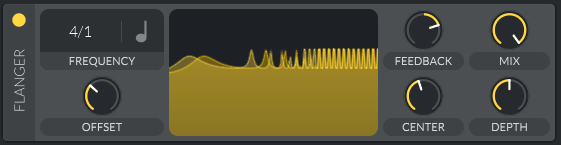

# Meadowlark Plugins Design Document

Meadowlark aims to be a FREE and open-source DAW (Digital Audio Workstation) for Linux, Mac and Windows. Its goals are to be a powerful recording, composing, editing, sound designing, mixing, and mastering tool for artists around the world, while also being intuitive and customizable.

# Objective

Our main focus for Meadowlark's suite of internal plugins will be on a suite of essential mixing and mastering FX plugins. (Contribution on synths and other exotic effects are welcome, but they are not a priority right now).

We obviously don't have the resources to compete with the DSP quality of companies like Waves, iZotope, or Fabfilter. Our aim is have "good enough" quality to where a producer can create a "pretty good" mix using Meadowlark's internal plugins alone. Essentially I want beginning producers to not feel like they have to hunt down external plugins for each part of the music production process. In addition this will make it much easier to create music production tutorials using Meadowlark's internal plugins alone.

Because we have a small team at the moment, we will focus more on porting DSP from other existing open source plugins to Rust rather than doing all of the R&D from scratch ourselves. People can still do their own R&D if they wish (and there are cases where we have to because an open source plugin doesn't exist for that case), but there already exists some great DSP in the open source world (especially in synth [`Vital`]). I've noted other open source plugins we can port the DSP in the `Plugin Suite` section below.

One more note on DSP. We should always consider replacing any biquad filters with the [`SVF`] filter as it behaves much better when being automated and tends to be more stable with high Q factors.

# Special note on using Rust

While we definitely prefer writing in Rust, if you wish to contribute DSP and you aren't comfortable with Rust, you are free to develop the DSP in whatever programming language you are comfortable with (On the one condition that the DSP be completely self-contained and not depend on any external DSP libraries). We can then port your code to Rust once you are done.

# Non-Goals

### Synths and Modularity

While we are definitely taking a lot of inspiration from Bitwig Studio, we won't be aiming for the same "DAW as a modular instrument" concept of Bitwig (at least not to the degree that Bitwig takes it). Here is my reasoning:
* Bitwig's modulators are a very complex concept to newcomers and non-sound-designers, and I feel having this as a core focus/feature in Meadowlark will only serve to deter those users away.
* Bitwig's modulator system adds a whole slew of complexity and clutter to the UI.
* IMO the sound quality, workflow, and performance is much better when using dedicated modular synths anyway. The developers of modular synths spend time making sure their specific modulators, oscillators, filters, and effects all sound and fit nicely together.
* Very complex modular synth setups can be very cumbersome to use when the UI is constrained to an inline horizontal FX rack.
* Dedicated synths are far more likely to have preset packs made for them. We want there to be a thriving community of preset makers for Meadowlark.
* Dedicated synths will also allow users to use Meadowlark's synths outside of Meadowlark if they wish.

Instead we will simply have macros, LFOs, envelopes, and a modulation matrix built into Meadowlark's "chain" plugin.

### Reusable DSP

We should avoid creating a "reusable DSP library". I believe those to be more of a hassle than they are worth, and they also serve to deter DSP experimentation and optimizations when developing plugins. Each plugin should have its own standalone and optimized DSP. We are of course still allowed to copy-paste portions of DSP between plugins as we see fit.

### Which plugins will live in this repository

Also note that while the architecture of [`dropseed`] technically treats every node in the audio graph as a "plugin", only the more "traditional" plugins like audio FX and synth plugins will live in the `meadowlark-plugins` repository.

Here is a list of "plugins" that will live inside the Meadowlark repository itself.
* Timeline Track plugin (plays audio, note, and automation clips on the timeline)
* Metronome plugin
* Mixer Track plugin (applies gain, pan, phase invert, solo, mute, and dB meter for a single track)
* Main Meter plugin (used to display the dB meters/oscilloscope/spectrogram on the top bar)
* Chain plugin
* Drum Machine plugin
* Send/Recieve plugin (both audio and note data)

And here is a list of "plugins" that will live inside the dropseed repo.
* Sample Browser Playback plugin (plays back a sample when it is selected in a browser)

(I may have missed some, but that is the general idea).

# MVP Goals

For MVP, we will only focus only on creating a few very basic plugins as a proof of concept. These simple plugins will include:
* A noise generator (generates white, pink, and brown noise)
* A gain/pan utitlity plugin
* A sine test tone generator

# Plugin Framework

Plugins will be created using the [`nih-plug`] framework.

In order to have feature-rich inline UIs in Meadowlark's horizontal FX rack, we will use our own custom CLAP extension that lives in the [`meadowlark-clap-exts`] repo *(This extension has yet to be written).* This allows us to only need one plugin framework for both the "used inside Meadowlark" target and the "used outside of Meadowlark" target.

# Plugin Suite

Here I'll list the suite of plugins I want for Meadowlark.

Each plugin is marked with a priority, with 5 asteriks (`*****`) being the highest priority, and one asterisk (`*`) being the lowest priority.

Also note that while I do reference [`Vital`] a lot here as a source of DSP, from now on I will reference the fully-GPL-licensed fork called [`Vitalium`]. This will ensure thate whatever we are porting from this plugin is licensed under GPL.

# Audio FX Suite

## ☐ Gain/pan/stereo width utility plugin
priority: `*****`

This will be a very basic plugin with just three parameters:
* gain
* pan
* stereo width

DSP for this should be fairly straight-forward.

## ☐ 2-band Splitter plugin
priority: `*****`

This will be 2-band splitter plugin.

This should have a gain parameter for each band, and a parameter to control the crossover frequency.

## ☐ 3-band Splitter plugin
priority: `*****`

This will be 3-band splitter plugin.

This should have a gain parameter for each band, and parameters to control the crossover frequencies.

## ☐ Mid/Side Splitter & Merger plugin
priority: `*****`

This will be 2 plugins (mid/side split and mid/side merge)

This should have a gain parameter for mid and side.

## ☐ L/R Splitter & Merger plugin
priority: `*****`

This will be 2 plugins (L/R split and L/R merge)

This split plugin will simply be a plugin that has one stereo audio in port and two mono audio out ports. The merge plugin will have two mono audio in ports and one stereo audio out port.

In addition there should be a gain parameter for the L and R channels.

## ☐ Time Shift plugin
priority: `*****`

A plugin that simply delays the signal by a given amount (either by samples or by ms).

We will likely use the optimized piece-wise interpolator described in this [`paper`](https://github.com/BillyDM/Awesome-Audio-DSP/blob/main/deip.pdf) for sub-sample interpolation.

In fact, because CLAP supports dynamic latency, we can even delay a signal by a negative amount! This will also give us a great tool to test the automatic delay compensation system in [`dropseed`]. (Although note that because dropseed requires recompilation of the audio graph every time latency is changed, this won't be as seamless as just turning a knob in Bitwig's Time Shift plugin. But hey, at-least it's even possible! Not even most commercial DAWs can claim to do this.)

## ☐ Parametric EQ
priority: `*****`

The parametric EQ is the most important and essential plugin in any kind of music production workflow, so it's important that we get this one right.

### DSP

This plugin should have the essentials:
* A lowshelf/lowpass band
    * The lowpass band should include various slopes including 6dB/oct, 12dB/oct, 24dB/oct, 36dB/oct, and 48dB/oct.
* A high-shelf/highpass band
    * The highpass band should include various slopes including 6dB/oct, 12dB/oct, 24dB/oct, 36dB/oct, and 48dB/oct.
* A variable number of bell/notch filter bands
* A spectrometer that can show either pre eq, post eq, or be off
    * Note that I personally prefer to have the "FL-Studio" style of spectrometer of using color to represent frequency intensity instead of the traditional "line graph" approach. I feel the latter gives a false impression of how humans actually hear sound, and it can lead to bad habits of "mixing with your eyes". I really like FL's approach here because the "wash of color" more accurately represents how our brains actually perceive frequencies as a "wash of frequencies". 
    * 

In addition I would like this eq to have two toggles:
* A toggle that turns on "adpative Q" mode. When enabled, it automatically narrows the Q factor as the gain of a band increases. This has the effect of sounding more "musical" to some people.
* If we go with a DSP algorithm that introduces latency, then we should add a "high quality" toggle (should be enabled by default) that switches between using latency for better quality, or using zero latency at the cost of worse quality.

Two more notes on quality:
* Frequencies should not "cramp" near the high end. For more info check out [this article](https://www.pro-tools-expert.com/production-expert-1/what-is-eq-cramping-and-should-you-care).
* The filters must behave well when being automated quickly (EQs are commonly used as filter effects in electronic music production).

### UI/UX

My favorite workflow for an EQ is that of Bitwig's older EQ5 plugin (I hate the workflow of their newer EQ+ plugin). Obviously having its UI be inline has its advantages, but the main reason I prefer it is because it exposes the gain/frequency/q parameters for *all* of the bands at once, not just the currently selected band. I think we should mostly follow this design for our EQ.

In addition we should add the ability to add more that 5 bands. We can have the inline UI automatically grow in size to acommadate the new bands. Because we are using the CLAP spec and our own UI library, this shouldn't be too big of an issue for us.

### Non-goals

This plugin will have no mid/side mode. This is because the user can easily construct a mid/side EQ by placing two EQs into the mid/side splitter plugin.

This plugin will have no "dynamic EQ" mode, since this would introduce a lot of complexity to our already cramped UI. The dynamic EQ will be its own plugin.

### Existing DSP References
* [`x42-fil4`](https://github.com/x42/fil4.lv2/tree/master) is shipped with the commercial Harrison Mixbus DAW, so it has great potential in the quality of its filters. It even states in its readme that it behaves well while being automated and it doesn't "cramp" near Nyquist, so already it checks a lot of boxes for us.
    * One thing I would change is to replace the biquad filters used for the high/low shelves with the [`SVF`] filter for better behavior when being automated.
* [`Vitalium`] has an [`equalizer module`](https://github.com/DISTRHO/DISTRHO-Ports/blob/master/ports-juce6/vitalium/source/synthesis/modules/equalizer_module.h) with 3 bands. I'm not certain on the quality of the filters used here, but they could be good.

## ☐ Single-band Compressor
priority: `*****`

### DSP

This will be a basic single-band compressor with the standard parameters:
* input gain
* attack
* release
* threshold
* ratio
* knee
* Peak/RMS mode (depending on the algorithm used)
* output gain

This plugin should also have an optional sidechain input with a basic lowpass and highpass filter applied to the sidechain signal.

In addition, this plugin should have a parameter that can switch between different compression algorithms. This will allow us to easily add new and improved algorithms in the future without having to create an entirely new plugin for each addition *(looking at you FL)*.

### UI/UX

I have no particular preferences on the design or workflow of this plugin. We can go simple with just knobs and a basic gain reduction meter, or we could go fancy with a waveform view that graphs the gain reduction in realtime. The one stipulation I have is to have a dropdown to select between different compression algorithms.

### Existing DSP References
* [`x42-darc`](https://github.com/x42/darc.lv2/tree/master) - This is another nice sounding compressor. This is probably a good one to have as the "default" algorithm.
* [`ZamCompX2`](https://github.com/zamaudio/zam-plugins/tree/master/plugins/ZamCompX2) - I like the sound of this compressor when applied to transient material like durms.
* [`Pressure4`](https://github.com/airwindows/airwindows/tree/master/plugins/LinuxVST/src/Pressure4) - This is probably Airwindow's most popular plugin and for good reason. It can add a lot of beef to drums and instruments.

## ☐ Dynamics Processor
priority: `****`

This is essentially a compressor but with the added ability to expand in addition to compress. This plugin will be able to switch between single-band mode and multi-band mode (3 bands).

### DSP

The compressor module in [`Vitalium`] is already exactly what I'm looking for, so I think we should simply port this module to Rust. The only addition we need to make is to add the crossover frequencies as parameters.

That being said, I do think we should consider adding a parameter that selects between different algorithms in case we want to add more compressor algorithms in the future. Although on the other hand, perhaps it might be better to just create a "mastering multiband compressor" as its own plugin later since that could have a different kind of workflow. I haven't decided on this yet.

### UI/UX

The workflow should work like that of Vitalium's compressor module / Ableton's Multiband Dynamics plugin. Each band has a dB meter for that band, along with rectangles that represent the range where expansion/compression is applied. The user can drag these rectangles to adjust the threshhold of the expansion/compression, as well as drag inside the rectangle to adjust the "ratio" of the expansion/compression.

In addition the UI should have a toggle to switch between single-band mode and multi-band mode, as well as knobs to adjust the crossover frequencies when in multi-band mode.

## ☐ Limiter
priority: `****`

### DSP

This will be a basic single-band limiter with the standard parameters:
* input gain
* threshold
* release
* look-ahead time (depending on the algorithm)

Like the single-band compressor, this plugin will also have a parameter that can switch between different limiting algorithms. This will allow us to easily add new and improved algorithms in the future without having to create an entirely new plugin for each addition.

### UI/UX

I have no particular preferences on the design or workflow of this plugin. We can go simple with just knobs and a basic gain reduction meter, or we could go fancy with a waveform view that graphs the gain reduction in realtime.

### Existing DSP References
* [`x42-dpl`](https://github.com/x42/dpl.lv2): This is a simple limiter plugin that sounds decent. It could work as the "default" algorithm.
* [`ZaMaximX2`](https://github.com/zamaudio/zam-plugins/tree/master/plugins/ZaMaximX2): This limiter sounds nice and a bit more "aggressive".

## ☐ Gate Plugin
priority: `****`

### DSP

This will be a basic single-band limiter with the standard parameters:
* input gain
* attack
* release
* threshold
* output gain

This plugin should also have an optional sidechain input with a basic lowpass and highpass filter applied to the sidechain signal.

Like the single-band compressor, this plugin will also have a parameter that can switch between different gating algorithms. This will allow us to easily add new and improved algorithms in the future without having to create an entirely new plugin for each addition.

### UI/UX

I have no particular preferences on the design or workflow of this plugin. We can go simple with just knobs and a basic gain reduction meter, or we could go fancy with a waveform view that graphs the gain reduction in realtime.

### Existing DSP References
* [`ZamGateX2`](https://github.com/zamaudio/zam-plugins/tree/master/plugins/ZamGateX2): This one seems decent.

## ☐ Bus Compressor
priority: `****`

*TODO: Decide how this plugin should work or if we should even include this as a separate plugin from the single-band compressor plugin.*

Basically I want a bus compressor that is modelled after something like the analogue "E/G series SSL 4000 buss" compressors like "The Glue" by Cytomic or Ableton's "Glue Compressor". IMO bus compressors like these are a very important part in achieving a "pretty good" mix.

A big problem though is that there are no existing open source plugins we can port or reference here. Perhaps we could start by modelling the circuits of the E/G series SSL 4000 buss compressors, but that is way above my skill level. If you happen to be an expert in modelling analog circuits and want to contribute, please do!

## ☐ Distortion/Saturation plugin
priority: `****`

There are a huge variety of distortion algorithms out there. So an important aspect of this plugin should be that it has a drop-down to select between different algorithms. This will allow us to easily add new and improved algorithms in the future without having to create an entirely new plugin for each addition *(looking at you FL)*.

### DSP

This plugin will contain the standard parameters:
* drive
* input gain
* output gain
* "character" (this will vary depending on the algorithm)
* wet/dry mix

In addition this plugin will contain a simple lp/bp/hp filter that can be either applied before the distortion, applied after the distortion, or be off. This filter will function identically to the distortion module in [`Vitalium`].

This plugin will start with these distortion algorithms:
* Soft Clip - the "Soft Clip" mode from [`Vitalium`]'s distortion module. This should be the default mode when loading the plugin.
* Hard Clip - the "Hard Clip" mode from [`Vitalium`]'s distortion module
* Linear Fold - the "Linear Fold" mode from [`Vitalium`]'s distortion module
* Sine Fold - the "Sine Fold" mode from [`Vitalium`]'s distortion module
* Bit Crush - the "Bit Crush" mode from [`Vitalium`]'s distortion module
* Down Sample - The "Down Sample" mode from [`Vitalium`]'s distortion module
* IronOxide - the [`IronOxide5`](https://github.com/airwindows/airwindows/tree/master/plugins/LinuxVST/src/IronOxide5) plugin by airwindows
* Density - the [`Density2`](https://github.com/airwindows/airwindows/tree/master/plugins/LinuxVST/src/Density2) plugin by airwindows
* Tape - the [`ToTape5`](https://github.com/airwindows/airwindows/tree/master/plugins/LinuxVST/src/ToTape5) plugin by airwindows

### Non-goals

This plugin won't contain any guitar-amp or guitar-cabinet simulations. I think that should be a separate plugin since it will require a lot more controls.

## ☐ Delay plugin
priority: `****`

The delay module in [`Vitalium`] is already exactly what I'm looking for here. I think we should just port it and its workflow.

## ☐ Reverb plugin
priority: `****`

There are a huge variety of reverb algorithms out there. So an important aspect of this plugin should be that it has a drop-down to select between different algorithms. This will allow us to easily add new and improved algorithms in the future without having to create an entirely new plugin for each addition *(looking at you FL)*.

### DSP

The parameters will probably vary depending on the plugin, but here is what parameters will generally be found on all algorithms:

* pre-delay
* size
* time (aka "feedback")
* wet/dry mix
* stereo width
* a low-shelf filter that is applied to the taps (aka "damping")
* a high-shelf filter that is applied to the taps

### Existing DSP references
* [`Vitalium`]'s reverb module - I think we should start by porting this one. I think it would make a good default reverb algorithm.
* [`Room Reverb`](https://github.com/cvde/RoomReverb) - This one sounds pretty decent for being an open source reverb.
* [`Aether`](https://github.com/Dougal-s/Aether) - This is a port of the outstanding CloudSeed shimmering reverb algorithm.

## ☐ Tremolo/Auto-Pan plugin
priority: `***`

This one should be pretty straightforward (control either gain or pan with an LFO).

The tremelo plugin will contain these basic LFO shapes:
* sine
* triangle
* square
* saw up
* saw down

In addition, the tremelo plugin should be able to either be synced to the current BPM, or run freely.

It should also stay aware of the current transport position so that the LFO's phase stays consistent between playbacks. There should also be a phase parameter to control the starting position of this phase relative to the start of the transport.

## ☐ DJM-Filter-like performance filter plugin
priority: `***`

### DSP

Essentially I want a plugin that functions exactly like Xfer's DJM-Filter plugin.

The main "filter cutoff" knob is dived into three sections:
* When this knob is in the left "LP" (lowpass) section, it activates the low-pass filter, and the cutoff of the lowpass filter starts from 20KHz at the top of the LP section, and it ends at 20Hz at the bottom of the LP section (min parameter value).
* When this knob is in the right "HP" (highpass) section, it activates the high-pass filter, and the cutoff of the highpass filter starts from 20Hz at the top of the HP section, and it ends at 20KHz at the bottom of the HP section (max parameter value) .
* When this knob is in the center section, both of the filters are turned off completely.

This design makes this filter very useful for creating live or automated transition effects with only needing a single knob (or a single automation clip) to control it.

In addition, this filter will also have these parameters:
* resonance
* filter drive

The lowpass and highpass filters will both be 2nd-order filters.

## ☐ Chorus plugin
priority: `***`

The chorus module in [`Vitalium`] is already exactly what I'm looking for here. I think we should just port it and its workflow.

## ☐ Flanger plugin
priority: `***`

The flanger module in [`Vitalium`] is already exactly what I'm looking for here. I think we should just port it and its workflow.

## ☐ Phaser plugin
priority: `***`

The phaser module in [`Vitalium`] is already exactly what I'm looking for here. I think we should just port it and its workflow.

## ☐ Filter plugin
priority: `***`

The filter module in [`Vitalium`] is already exactly what I'm looking for here. I think we should just port it and its workflow.

## ☐ Convolver
priority: `***`

A plugin that simply convolutes a signal from a given impulse response. Useful for high quality reverbs and guitar cabinet simulations.

### Existing DSP references
[`IR.lv2`](https://github.com/Anchakor/ir.lv2)
[`libzita-convolver`](http://kokkinizita.linuxaudio.org/linuxaudio/downloads/)

## ☐ Dynamic EQ
priority: `**`

### DSP

This will be very similar to the parameteric EQ plugin except that the gain of each band can be sidechained by an signal (either internal or from an external sidechain port) like a compressor. When the sidechain source is from the internal source, the "compressor" should only listen to the frequencies that make up that band as its input.

Each band will have these additional parameters:
* threshold
* attack
* release

Once we have both the parametric eq and a single band compressor, in theory this shouldn't be too hard to implement.

This dynamic EQ will also serve as our "de-esser" plugin since this is pretty much what de-essers already.

### UI/UX

Unlike the regular parametric EQ plugin, this plugin will probably only show controls for the currently selected band as apposed to showing the controls for every band at once.

## ☐ Analog EQ
priority: `**`

This will be a plugin with a drop-down to select from several different analogue-modelled EQ algorithms. This will also allow us to easily add new and improved algorithms in the future without having to create an entirely new plugin for each addition.

### UI/UX

This plugin should be basic in its UI and only include knobs (just like a real analogue EQ).

### Existing DSP references
* [`Luftikus`](https://github.com/DISTRHO/DISTRHO-Ports/tree/master/ports-juce5/luftikus)

## ☐ Vibrato plugin
priority: `**`

*TODO: Decide how this plugin should work or if we should even include this as a plugin.*

## ☐ Vocal Compressor
priority: `**`

*TODO: Decide how this plugin should work or if we should even include this as a separate plugin from the single-band compressor plugin.*

Since mixing vocals will probably be a very common task users want to do in Meadowlark, I think we should have a good vocal compressor (perhaps modelled after the famous LA2A compressor).

A big problem though is that there are no existing open source plugins we can port or reference here. Perhaps we could start by modelling the circuits of the LA2A compressor, but that is way above my skill level. If you happen to be an expert in modelling analog circuits and want to contribute, please do!

## ☐ Guitar Amp/Cabinet plugin
priority: `**`

*TODO: Decide how this plugin should work or if we should even include this as a plugin.*

### Existing DSP references
[`Guitarix`](https://github.com/brummer10/guitarix) - This seems like a good place to start.

## ☐ Mastering Compressor/Limiter
priority: `*`

*TODO: Decide how this plugin should work or if we should even include this as a separate plugin.*

## ☐ Linear phase EQ
priority: `*`

*TODO: Decide how this plugin should work or if we should even include this as a plugin. I don't exactly want to include this in the main "parametric eq" plugin since the massive amount of introduced latency would be quite jarring when switching between regular mode and linear-phase mode.*

## ☐ Vocoder
priority: `*`

*TODO: Decide how this plugin should work or if we should even include this as a plugin.*

# Vizualizer Plugins

## ☐ Oscilloscope
priority: `**`

This should include controls for the input gain & the time window.

This should also be able to accept incominig MIDI notes to automatically set the time window based on the pitch of the MIDI note.

There should also be a button to freeze/unfreeze the display.

## ☐ Spectrometer/Spectrogram
priority: `**`

This should be able to switch between the "classic" style (like Voxengo Span) and the "FL-style" (like the spectrogram in Fruity Wavecandy).

*TODO: screenshots of these plugins*

### Existing DSP references
* [`Wolf Spectrum`](https://github.com/wolf-plugins/wolf-spectrum) - This is a good one to reference for the "FL-style" mode.

## ☐ Goniometer/Phase correlation meter
priority: `**`

This is used to measure the phase correlation of a stereo signal.

### Existing DSP references
* [`easySSP`](https://github.com/DISTRHO/DISTRHO-Ports/tree/master/ports-juce5/easySSP)

## ☐ Loudness meter
priority: `*`

This should be able to detect the loudness with different methods such as RMS and EBU.

### Existing DSP references
* [`LUFSMeter`](https://github.com/klangfreund/LUFSMeter)

# Synth/Generator Plugins

## ☐ Noise Generator
priority: `*****`

A simple noise generator that can generate white, pink, and brown noise.

This is mainly meant more as a "proof of concept" plugin since it is very easy to implement, but it can have some practical uses.

## ☐ Test Tone Generator
priority: `*****`

A simple sine wave generator that can smoothly sweep between 20Hz and 20KHz.

This is mainly meant more as a "proof of concept" plugin since it is very easy to implement, but it can have some practical uses.

## ☐ Sampler
priority: `****`

This should be able to play a given sample when triggered by a MIDI note, and it should be able to repitch the sample based on the pitch of the MIDI note.

It should also include an AHDSR gain envelope, as well as an ADSR pitch envelope.

## ☐ Multi-sampler
priority: `**`

This is used to play both soundfount (SF2) files and [`SFZ`](https://sfzformat.com) files.

### DSP

Like the sampler plugin, also include a (per-note) AHDSR gain envelope. We might also add a per-note ADSR pitch envelope if it's not too much trouble.

### UI/UX

The UI should at least show a keyboard display that shows the range of keys that can play samples, as well which keys are marked as "keyswitches".

## ☐ Simple "3xOSC"-like synth
priority: `***`

The main purpose of this is to quickly have some kind of basic built-in synth for Meadowlark. This will be heavily inspired by FL-studio's 3xOSC plugin.

### DSP

This synth will include:
* 3 Oscillators with selectable shapes (saw, square, pulse, triangle, noise, etc).
* ADSR gain envelope
* Single LP/BP/HP filter
* ADSR filter envelope
* ADSR pitch envelope
* One or two LFOs
    * LFOs will include basic shapes such as sine, triangle, square, saw up, saw down, random-hold, and random-glide
    * LFOs should be able to sync to BPM or be free-running
    * LFOs should be able to either restart on each new note, or run freely
    * LFOs should be able to target gain, filter cutoff, filter Q, pan, and pitch
* Portamento
* Legato mode
* Simple waveshaper distortion effect
* Simple delay effect
* Simple chorus effect

### UI/UX

Since this plugin is simple enough, we can probably focus on fitting it in an inline UI.

## ☐ Flagship subtractive synth
priority: `*`

*(TODO: Decide how this should work)*

My main idea here is to take the [`Surge`](https://surge-synthesizer.github.io) synth, trim down a lot of its excess features, and completely overhaul the UI/UX.

### UI/UX

I don't think it makes much sense to pack something this complex into a inline horizontal FX rack UI. This plugin should have its own dedicated UI.

## ☐ Simple FM Synth
priority: `*`

*(TODO: Decide how this should work)*

No real guidelines at the moment. I'm mostly just picturing a synth along the lines of [`JuceOPL`](http://www.linuxsynths.com/JuceOPLPatchesDemos/juceopl.html) or [`ADLplug`](http://www.linuxsynths.com/ADLplugPatchesDemos/adlplug.html).

## ☐ Flagship FM synth
priority: `*`

*(TODO: Decide how this should work or if this should even be included)*

## ☐ Flagship wavetable synth
priority: `*`

*(TODO: Decide how this should work or if this should even be included, especially since most people will just use Vital anyway)*

## ☐ Flagship additive synth
priority: `*`

*(TODO: Decide how this should work or if this should even be included)*

## ☐ Flagship granular synth
priority: `*`

*(TODO: Decide how this should work or if this should even be included)*

## ☐ Flagship modular synth
priority: `*`

*(TODO: Decide how this should work or if this should even be included)*

Basically I'm envisioning something like Bitwig's The Grid. That is a very lofty goal though.

# MIDI/Note FX plugins

## ☐ Note Transpose
priority: `***`

This will be a plugin that simply transposes notes by a given amount.

### UI/UX

The controls should work just like Bitwig's Note Transpose plugin.

* Transpose up/down by a whole octave
* Transpose up/down by a semitone
* Fine tune

## ☐ Arpeggiator
priority: `**`

*(TODO: Decide how this should work)*

## ☐ Note Expression Mapper
priority: `**`

This uses a user-adjustable curve to map one of the targets:
* velocity
* pan
* tuning (relative tuning in semitone, from -120 to +120)
* vibrato
* expression
* brightness
* pressure

In addition to the curve, there should be a "randomness" parameter that adds a random offset to each value (the parameter controls how much offset).

## ☐ Note Transpose Map
priority: `**`

This is used clamp all notes to fall within a certain scale. Useful for bad keyboard players like me :D.

For example, this is what Bitwig's Transpose Map plugin looks like. We can probably do something similar.

## ☐ Auto-Chord plugin
priority: `*`

This is used to automatically play chords in a given scale from a single note.

*(TODO: Decide how this should work)*

[`nih-plug`]: https://github.com/robbert-vdh/nih-plug
[`meadowlark-clap-exts`]: https://github.com/MeadowlarkDAW/meadowlark-clap-exts
[`dropseed`]: https://github.com/MeadowlarkDAW/dropseed
[`Vital`]: https://github.com/mtytel/vital
[`Vitalium`]: https://github.com/DISTRHO/DISTRHO-Ports/tree/master/ports-juce6/vitalium
[`SVF`]: https://github.com/wrl/baseplug/blob/trunk/examples/svf/svf_simper.rs